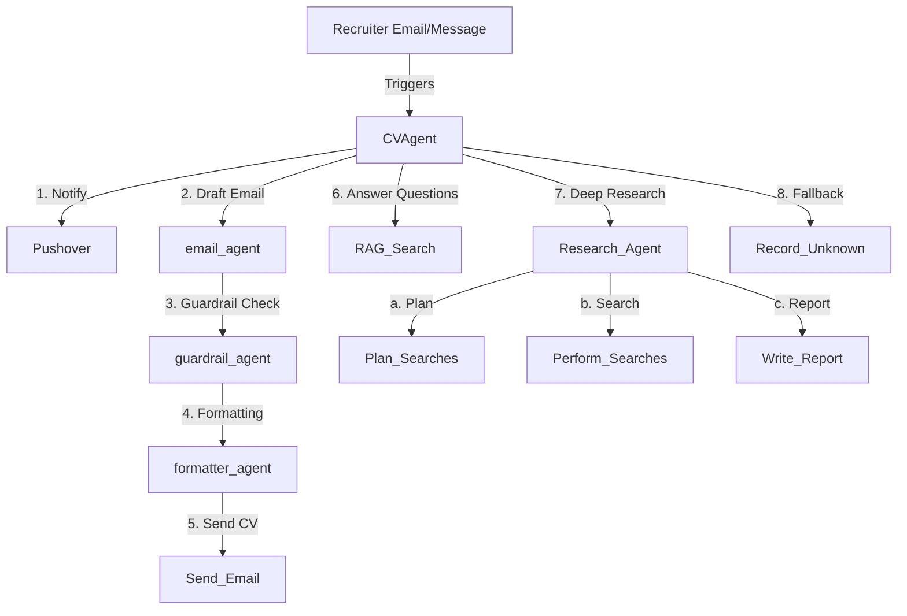

<h1 align="center" style="color:#ffffff;background:#111;padding:20px;border-radius:12px;">
🚀 Recruiter Manager Agent  
<span style="font-size:0.7em;color:#ccc;">Automating Felipe’s recruiter interactions</span>
</h1>

<p align="center">
  
  
  
  
</p>

---

<div style="background:#222;color:#eee;padding:20px;border-radius:12px;margin-bottom:20px;">
<h2>✨ Overview</h2>

The **Recruiter Manager Agent** is an AI-powered assistant that manages recruiter interactions for  
<strong><a href="https://www.linkedin.com/in/felipe-schreiber/" style="color:#4ea1ff;">Felipe Schreiber Fernandes</a></strong>.

It ensures that every recruiter who reaches out:
- 📲 Triggers a **push notification** via Pushover.  
- 📧 Receives an **automatic email with Felipe’s CV** attached.  
- 📚 Can ask questions about Felipe’s **thesis, academic, and professional projects** via Retrieval-Augmented Generation (RAG).  
- 🛡️ Has sensitive or inappropriate questions safely **logged** without leaking personal data.  
- ✨ All outgoing emails are **guarded and formatted** for professionalism and safety.
- 🔬 **Deep Research Pipeline** – Uses a multi-step agent to perform web research and generate detailed reports for recruiter queries.
</div>

---

<div style="background:#111;color:#fff;padding:20px;border-radius:12px;">
<h2>⚙️ Features</h2>

- 🔔 **Pushover Integration** – Instant recruiter notifications to Felipe’s phone.  
- 📄 **Automatic CV Delivery** – Sends Felipe’s CV as a PDF attachment via SendGrid.  
- 🛡️ **Guardrail Agent** – Ensures email bodies are safe, polite, and professional.  
- ✨ **Formatter Agent** – Beautifies email bodies, adds salutations, line breaks, and proper closing.  
- 🔎 **RAG Search** – Provides fact-based answers about Felipe’s work (thesis, NLP projects, etc.) using FAISS + OpenAI embeddings.  
- 🛑 **Unknown Question Logging** – Records any irrelevant or unanswerable recruiter queries.  
- 🤝 **Multi-step Workflows** – When recruiters both introduce a job and ask project questions, the agent handles **both actions** in parallel.
- 🧠 **Research Agent Pipeline** – Plans searches, performs web research, and writes comprehensive reports using OpenAI agents.
</div>

---

<div style="background:#222;color:#eee;padding:20px;border-radius:12px;">
<h2>🔬 Deep Research Pipeline</h2>

The **Research Agent** automates multi-step web research for recruiter queries:
1. **Plans searches** relevant to the recruiter’s question.
2. **Performs web searches** asynchronously.
3. **Synthesizes results** into a detailed, markdown-formatted report.
4. **Streams status updates** throughout the process for transparency.

This enables recruiters to receive not only CVs and project answers, but also in-depth, up-to-date research on Felipe’s expertise or market trends.

---

<div style="background:#222;color:#eee;padding:20px;border-radius:12px;">
<h2>📐 Architecture</h2>



---

<div style="background:#222;color:#eee;padding:20px;border-radius:12px;">
<h2>🚀 Getting Started</h2>

```bash
git clone https://github.com/FelipeSchreiber/curriculum_vitae_agent.git
cd curriculum_vitae_agent
python -m venv venv
venv\Scripts\activate  # On Windows, or `source venv/bin/activate` on Mac/Linux
pip install -r requirements.txt
cp .env.example .env  # Set your API keys and email credentials
python main.py
```
</div>

---

<div style="background:#222;color:#eee;padding:20px;border-radius:12px;">
<h2>📝 License & Credits</h2>
This project uses OpenAI, FAISS, and SendGrid.  
See [LICENSE](LICENSE) for details.
